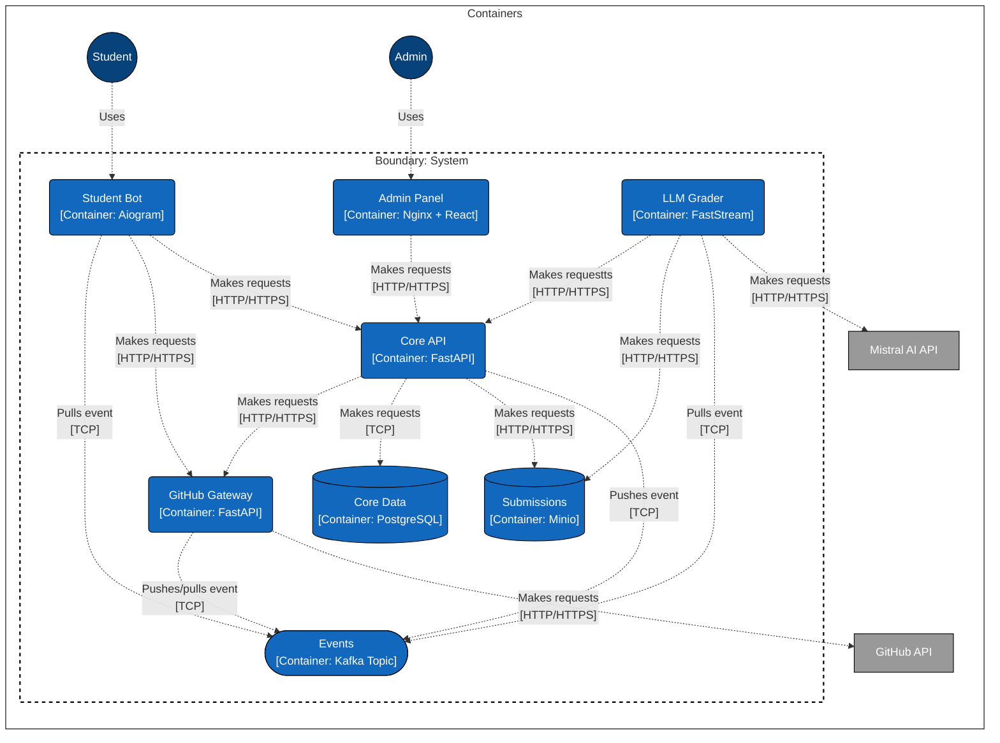

## Система оценивания практических работ студентов с помощью LLM

### Архитектура

```mermaid
graph LR
    %% C4 style classes c4model.com %%
    classDef person fill:#08427b,stroke:black,color:white;
    classDef container fill:#1168bd,stroke:black,color:white;
    classDef database fill:#1168bd,stroke:black,color:white;
    classDef software fill:#1168bd,stroke:black,color:white;
    classDef existing fill:#999999,stroke:black,color:white;
    classDef boundary fill:white,stroke:black,stroke-width:2px,stroke-dasharray: 5 5;
    classDef frame fill:white,stroke:black;


    %% nodes %%
    GitHub["GitHub API"]:::existing
    Mistral["Mistral AI API"]:::existing
    Admin((Admin)):::person
    Student((Student)):::person
    WebApp("Admin Panel <br>[Container: Nginx + React]"):::container
    CoreAPI("Core API <br>[Container: FastAPI]"):::container
    Worker("LLM Grader <br>[Container: FastStream]"):::container
    GitHubGateway("GitHub Gateway <br>[Container: FastAPI]"):::container
    CoreDB[("Core Data <br>[Container: PostgreSQL]")]:::database
    S3[("Submissions <br>[Container: Minio]")]:::database
    Events(["Events <br>[Container: Kafka Topic]"]):::container
    TGBot("Student Bot <br>[Container: Aiogram]"):::container

    %% connections and boundaries %%
    
    subgraph Legend [Containers]
        Student-.->|Uses| TGBot
        Admin-.->|Uses| WebApp
        
        subgraph Boundary["Boundary: System"]
            WebApp-.->|"Makes requests <br> [HTTP/HTTPS]"| CoreAPI
            CoreAPI-.->|"Makes requests  <br> [HTTP/HTTPS]"| GitHubGateway
            CoreAPI-.->|"Makes requests  <br> [TCP]"| CoreDB
            CoreAPI-.->|"Makes requests <br> [HTTP/HTTPS]"| S3

            Worker-.->|"Makes requestts <br> [HTTP/HTTPS]"| CoreAPI
            Worker-.->|"Makes requests <br> [HTTP/HTTPS]"| S3

            CoreAPI-.->|"Pushes event  <br> [TCP]"| Events
            TGBot-.->|"Pulls event <br> [TCP]"| Events
            Worker-.->|"Pulls event <br> [TCP]"| Events
            GitHubGateway-.->|"Pushes/pulls event <br> [TCP]"| Events

            
            TGBot-.->|"Makes requests <br> [HTTP/HTTPS]"| GitHubGateway
            TGBot-.->|"Makes requests <br> [HTTP/HTTPS]"| CoreAPI

        end
        class Boundary boundary
        
        GitHubGateway-.->|"Makes requests <br> [HTTP/HTTPS]"| GitHub
        Worker-.->|"Makes requests <br> [HTTP/HTTPS]"| Mistral
    end
    class Legend frame
```

### Скриншоты

#### Задачи

#### Жалобы/вопросы студентов

#### Студенты

